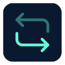

<h1 align="center">MirrorTab</h1>

  
   
  <em>Mirror DOM interactions from a source tab to a target tab in real time.</em>
   

  <a href="CONTRIBUTING.md">Contributing Guidelines</a>
  ·
  <a href="https://github.com/KostaD02/MirrorTab/issues">Submit an Issue</a>
   

  

MirrorTab is a Chrome extension that captures user interactions on one browser tab (the **source**) and replays them live on another tab (the **target**). It supports clicks, keyboard input, form changes, scrolling, and mouse movement - with session recording and export built in.

## Features

- **Live mirroring** - clicks, inputs, keystrokes, scroll events, and mouse movement are forwarded from the source tab to the target tab in real time
- **Ghost cursor** - a virtual cursor on the target tab shows exactly where the source user is pointing and clicking
- **Session control** - start, pause, resume, and stop a mirroring session from the popup
- **Role badges** - a floating badge on each tab shows whether it is SOURCE or TARGET
- **Session recording** - all events replayed on the target tab are recorded with timestamps
- **Export** - download the recorded session as JSON or plain text before or after stopping
- **Smart selector** - elements with an `id` are resolved via `#id`; all others use a full structural CSS path, keeping replay accurate across DOM changes

The production bundle can be downloaded from [releases](https://github.com/KostaD02/MirrorTab/releases).

## Usage

1. Click the **MirrorTab** icon in the Chrome toolbar to open the popup
2. Enter a **Source URL** and a **Target URL**
3. Click **Start Session** - two new tabs will open automatically
4. Interact with the **SOURCE** tab; every action is mirrored to the **TARGET** tab in real time
5. Use **Pause / Resume** to temporarily suspend mirroring without closing the session
6. Use **Download JSON** or **Download Text** to export the full event log from the target tab at any time
7. Click **Stop** to end the session - recorded events are cleared

## Recorded event format

Each entry in the exported session log contains:

| Field                | Description                                                                       |
| -------------------- | --------------------------------------------------------------------------------- |
| `timestamp`          | ISO 8601 timestamp of when the event was replayed                                 |
| `type`               | Event type: `click`, `input`, `change`, `keydown`, `keyup`, `scroll`, `mousemove` |
| `selector`           | Compact element identifier: `TAG#id#firstClass#attr=val`                          |
| `selectorStackTrace` | Full CSS structural path used for DOM resolution                                  |
| `content`            | Event-specific payload (coordinates, value, key info, scroll position)            |

## Permissions

| Permission  | Reason                                                               |
| ----------- | -------------------------------------------------------------------- |
| `tabs`      | Open source/target tabs and track their lifecycle                    |
| `activeTab` | Access the active tab in response to user interaction with the popup |
| `storage`   | Persist the active session across service worker restarts            |

## Contributing

Bug reports and feature requests are welcome via [GitHub Issues](https://github.com/KostaD02/MirrorTab/issues).

Please refer to our [Contributing Guidelines](CONTRIBUTING.md) for details on our code of conduct, development setup, and the process for submitting pull requests to us.

## Security

Please review our [Security Policy](SECURITY.md) for information on supported versions and details regarding how to responsibly report security vulnerabilities.

## License

[MIT](./LICENSE) © Konstantine Datunishvili
